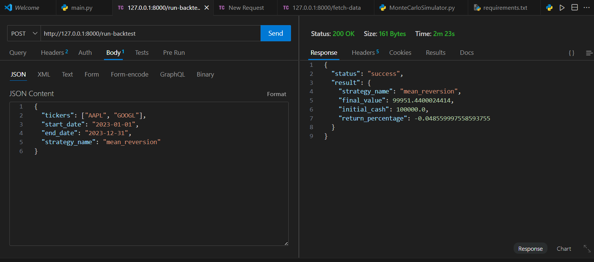
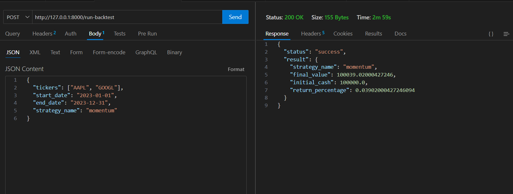
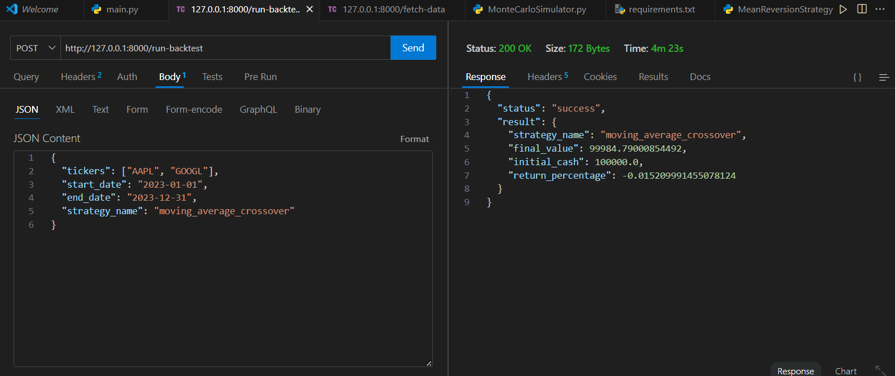

# QuantifyTrade

QuantifyTrade is a algorithmic trading system built with FastAPI. The project integrates advanced mathematical and numerical methods to create, backtest, and analyze various trading strategies. It includes well-known strategies such as Mean Reversion, Momentum, and Moving Average Crossover, and leverages Monte Carlo simulations for performance evaluation.


## Features

### 1. Trading Strategies Implemented:
- #### Mean Reversion Strategy: 
  - This strategy identifies when an asset is overbought or oversold based on its price deviating from the moving average. It buys assets when the price is below the moving average and sells when it is above.
  
  - Implemented Trading_Strategies/MeanReversionStrategy.py.
  - **Logic:** Buys when the asset price is below the moving average and sells when it is above.


- #### Momentum Strategy: 
  - This strategy buys assets with positive momentum and sells those with negative momentum, aiming to capture trends.

  
  - Implemented in MomentumStrategy.py
  
  - **Logic:** Buys assets with positive momentum and sells those with negative momentum.

- #### Moving Average Crossover Strategy:
  - This strategy uses short-term and long-term moving averages to generate buy and sell signals, trading based on the crossover points. 
  - Implemented in MovingAverageCrossoverStrategy.py
  

  - **Logic:** Uses short-term and long-term moving averages to generate trading signals.

### 2. Mathematical and Numerical Methods:
- #### Monte Carlo Methods:
  Applied to simulate and analyze potential future returns, assessing the risk and return characteristics of each strategy through repeated random sampling.
- #### Differential Equations, Applied Probability and Statistics:
  Used in modeling price movements and optimizing trading algorithms, also used to analyze and validate trading strategies, ensuring robust performance metrics.  


## API Endpoints:

#### 1. Read Root:

```
 GET: http://127.0.0.1:8000/
```
- Description: Provides information about available trading strategies and the API.

``` 
Returns:
message: Welcome message.
available_strategies: Description of each trading strategy implemented.
   ```

#### 2. Run Backtest:

```
 POST: http://127.0.0.1:8000/run-backtest
```
- Description: Runs a backtest for the specified trading strategy using historical data and performs a Monte Carlo simulation to evaluate strategy performance.


``` 
Parameters:
tickers: List of asset tickers.
start_date: Start date of the data range.
end_date: End date of the data range.
strategy_name: The trading strategy to test (e.g., "mean_reversion", "momentum", "moving_average_crossover").
   ```
```
Returns:
status: Success or failure status.
result: Summary of backtest and simulation results, including final value, return percentage, mean return, and standard deviation.

```


## Screenshots
### Mean Reversion Strategy: 


### Momentum Strategy:


### Moving Average Crossover Strategy:


## Contributing

Contributions are welcome! Please submit a pull request or open an issue to discuss improvements or features.


